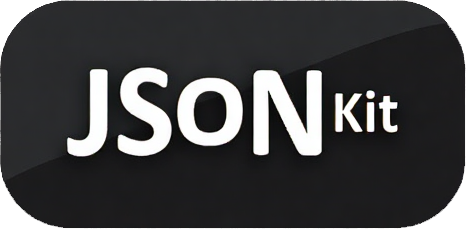

# JSONKit. Удобный редактор JSON файлов



**JSONKit** — это Node.js приложение с веб-интерфейсом для удобного редактирования JSON файлов. Подходит для разработчиков и администраторов, работающих с конфигурациями в формате JSON.

Используйте JSONKit для редактирования JSON-файлов в ваших веб-сервисах в Docker, и ваши волосы станут мягкими и шелковистыми.

## Возможности

- 📝 Редактирование JSON файлов в интуитивном веб-интерфейсе
- 🔍 Валидация синтаксиса JSON в реальном времени
- 📂 Поддержка навигации по  локальным файлам
- 🔄 Автоматическое отслеживание изменений
- 🌈 Подсветка синтаксиса
- 🐳 Готовый Docker-образ для быстрого развертывания

### Почему JSONKit — это must-have для работы с JSON?

✅ Больше не нужно гадать, где вы забыли запятую — мы подсветим её красным, как стоп-сигнал!

✅ Избавляет от стресса при виде `Unexpected token }` — теперь ошибки показываются до того, как ваш код взорвётся.

✅ Спасёт ваши отношения с коллегами — больше не придётся спорить, был ли файл отформатирован в 2 или 4 пробела.

✅ Повышает КПД — меньше времени на ручное редактирование, больше на кофе-брейки (или на прокрастинацию, мы не осуждаем).

✅ Работает даже с тем JSON’ом, который вы наспех накидали в Notepad — мы всё равно попробуем его распарсить (но без гарантий).

✅ Docker-образ легче вашей последней npm-зависимости — запускается за секунды и не сломает систему.

✅ Превосходит кривые руки — если ваш JSON выглядел как лапша, теперь он будет как карбонара в дорогом ресторане.

💡 Бонус: если отправите баг-репорт, мы сделаем вид, что это фича!

(Шутки шутками, но JSONKit реально упрощает работу 😉)

## Требования

- Node.js 16+
- npm 8+ или yarn
- Docker (опционально)

## Установка и запуск

### Локальная установка

1. Клонируйте репозиторий:

```bash
git clone https://github.com/rikkimongoose/jsonKit/
cd JSONKit
```
2. Установите зависимости:
```bash
npm install
```
или

```bash
yarn install
```

3. Запустите приложение:

```bash
npm start
```
или
```bash
yarn start
```
4. Откройте в браузере: http://localhost:3000

### Запуск через Docker
1. Соберите Docker-образ:

```bash
docker build -t jsonkit .
```

2. Запустите контейнер

```bash
docker run -d -p 3000:3000 --name jsonkit jsonkit
```

3. Откройте в браузере: http://localhost:3000

### Использование
- Найдите нужный JSON файл через интерфейс навигации или создайте новый

- Редактируйте содержимое в удобном редакторе

- Сохраните изменения обратно в файл

## Конфигурация
Настройки приложения можно изменить в файле `config.json`:

```json
{
    "server": {
      "port": 3000,
      "portWss": 8080,
      "staticFiles": "./public"
    },
    "app": {
      "version": "1.0"
    },
    "navigation": {
        "jsonDirectory": "./examples",
        "extDataFilterSize": 2,
        "extData": {
          "urlPath": "$.mappings[*].request.urlPath",
          "urlPathTemplate": "$.mappings[*].request.urlPathTemplate"
        }
    }
}
```
## Лицензия
GNU GPL v3. См. файл LICENSE для подробной информации.
